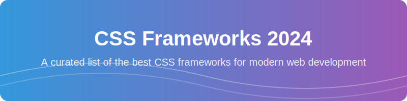

# 🎨 CSS Frameworks 2024 🚀

**A curated list of the most popular, lightweight, and modern CSS frameworks for web development in 2024.**

---

## 📖 Overview

Welcome to the ultimate repository for **CSS Frameworks in 2024**! Whether you are looking for a utility-first framework like Tailwind CSS, a component-based system like Bootstrap, or a minimalist approach like Pico.css, this list has you covered. 

Our goal is to help developers find the best **UI/UX tools** to build responsive, accessible, and high-performance websites.

---

## 📑 Table of Contents

- [🚀 Featured Frameworks](#-featured-frameworks)
- [🛠️ How to Choose?](#-how-to-choose)
- [🤝 Contributing](#-contributing)
- [📄 License](#-license)

---

## 🚀 Featured Frameworks

| ✨ Framework Name | 🎯 Main Purpose | 🌐 Home Page | 💻 Github Repo | 📚 Documentation |
| :--- | :--- | :--- | :--- | :--- |
| **7.css** | 🧥 Lightweight CSS framework for basic styling | [Visit](https://github.com/topics/css-framework) | [Repo](https://github.com/khang-nd/7.css/) | ❌ |
| **98.css** | 🪟 Windows 98 style CSS library | [Visit](https://github.com/jdan/98.css/issues) | [Repo](https://github.com/jdan/98.css/) | ❌ |
| **Base** | 🧱 Build responsive layouts with typography focus | [Visit](https://github.com/getbase/base) | ❌ | [Docs](https://github.com/getbase/base) |
| **Basscss** | ⚡ Low-level CSS toolkit for consistent designs | [Visit](https://basscss.com/) | [Repo](https://github.com/basscss/basscss) | [Docs](https://basscss.com/) |
| **Beer CSS** | 🍺 Sass framework for writing responsive CSS | [Visit](https://www.beercss.com/) | [Repo](https://github.com/beercss/beercss) | ❌ |
| **Blaze UI** | 🔥 Commercial UI framework based on Web Components | [Visit](http://docs.react-blazeui.io/) | ❌ | [Docs](http://docs.react-blazeui.io/) |
| **Bojler** | 🛠️ Starter kit with HTML, CSS, and JS | [Visit](https://github.com/Slicejack/bojler) | [Repo](https://github.com/Slicejack/bojler) | ❌ |
| **Bootstrap** | 🌟 Most popular framework for responsive web | [Visit](https://getbootstrap.com/) | [Repo](https://github.com/twbs) | [Docs](https://getbootstrap.com/) |
| **Bourbon** | 🥃 Sass mixins and functions for writing CSS | [Visit](https://www.bourbon.io/) | [Repo](https://github.com/topics/bourbon) | [Docs](https://www.bourbon.io/) |
| **Bulma** | 💎 Lightweight framework based on Flexbox | [Visit](https://bulma.io/) | [Repo](https://github.com/jgthms/bulma) | [Docs](https://bulma.io/) |
| **Carbon** | 🔵 IBM's design system for web applications | [Visit](https://carbondesignsystem.com/) | [Repo](https://github.com/carbon-design-system/carbon) | [Docs](https://carbondesignsystem.com/) |
| **Centurion** | 🛡️ Enterprise-grade UI framework | [Visit](http://www.centurionframework.com/) | [Repo](https://github.com/Nakazoto/CenturionComputer) | ❌ |
| **Chota** | 🤏 Minimalist CSS framework for small projects | [Visit](https://github.com/iotaledger) | [Repo](https://github.com/iotaledger) | ❌ |
| **Cirrus** | ☁️ UI component library for modern web apps | [Visit](https://app.netlify.com/start/deploy?repository=https://github.com/cemujax/gatsby-starter-cemu) | ❌ | ❌ |
| **Concise CSS** | 📐 CSS framework for responsive layouts | [Visit](https://concisecss.com/) | [Repo](https://github.com/topics/css) | [Docs](https://concisecss.com/) |
| **CSS Remedy** | 💊 Utility-first CSS framework for rapid theming | [Visit](https://github.com/jensimmons/cssremedy) | [Repo](https://github.com/jensimmons/cssremedy) | ❌ |
| **Cutestrap** | 🎀 Responsive and modular framework | [Visit](https://www.cutestrap.com/) | [Repo](https://github.com/RandyGaul/cute_headers) | ❌ |
| **Fomantic-UI** | 🧩 UI framework for semantic interfaces | [Visit](https://fomantic-ui.com/) | [Repo](https://github.com/fomantic/Fomantic-UI) | [Docs](https://fomantic-ui.com/) |
| **Foundation** | 🏗️ Mature and robust framework for projects | [Visit](https://get.foundation/develop/getting-started.html) | [Repo](https://github.com/foundation) | [Docs](https://get.foundation/develop/getting-started.html) |
| **Gutenberg** | 🖋️ Blocks for building rich content editors | [Visit](https://github.com/WordPress/gutenberg) | [Repo](https://github.com/WordPress/gutenberg) | ❌ |
| **HiQ** | 📈 Lightweight CSS framework for responsive | [Visit](https://docs.antora.org/antora/latest/publish-to-github-pages/) | [Repo](https://docs.antora.org/antora/latest/publish-to-github-pages/) | ❌ |
| **inuitcss** | ⛷️ CSS toolkit for building scalable UIs | ❌ | [Repo](https://github.com/inuitcss/inuitcss) | ❌ |
| **Material Web** | 📱 Google's material design components | [Visit](https://material.io/components/web/) | [Repo](https://github.com/material-components/material-components-web) | [Docs](https://material.io/components/web/) |
| **Materialize** | 🎨 CSS framework for Google's Material Design | [Visit](https://materializecss.com) | ❌ | [Docs](https://materializecss.com) |
| **Milligram** | ⚖️ Minimalist CSS framework for basic styling | [Visit](https://milligram.io) | [Repo](https://github.com/milligram/milligram) | [Docs](https://milligram.io) |
| **minireset** | 🧹 Minimal CSS reset for consistent rendering | [Visit](https://jgthms.com/minireset.css/) | [Repo](https://github.com/jgthms/minireset.css/) | ❌ |
| **modern-reset** | 🔄 Modern CSS reset for baseline styles | [Visit](https://github.com/hankchizljaw/modern-css-reset) | [Repo](https://github.com/hankchizljaw/modern-css-reset) | ❌ |
| **modern-normalize** | 📏 CSS reset for consistent browser rendering | [Visit](https://github.com/sindresorhus/modern-normalize) | [Repo](https://github.com/sindresorhus/modern-normalize) | ❌ |
| **MUI** | ⚛️ React component library for Material Design | [Visit](https://next.mui.com/) | [Repo](https://github.com/mui/material-ui) | [Docs](https://next.mui.com/) |
| **MVP.css** | 🏆 Minimal CSS framework for prototyping | [Visit](https://andybrewer.github.io/mvp/) | [Repo](https://github.com/andybrewer/mvp) | ❌ |
| **Natural** | 🌿 Lightweight CSS framework for responsive | [Visit](https://github.com/frontaid/natural-selection) | [Repo](https://github.com/frontaid/natural-selection) | ❌ |
| **NES.css** | 🎮 8-bit video game aesthetics | [Visit](https://nostalgic-css.github.io/NES.css/) | ❌ | ❌ |
| **Open Props** | 🔑 CSS-in-JS library for CSS variables | [Visit](https://open-props.style/) | ❌ | [Docs](https://open-props.style/) |
| **Panda CSS** | 🐼 Type-safe CSS-in-JS with utility-first | [Visit](https://panda-css.com/) | [Repo](https://github.com/chakra-ui/panda) | [Docs](https://panda-css.com/) |
| **PatternFly** | ✈️ Enterprise-grade UI framework | [Visit](https://www.patternfly.org/) | [Repo](https://github.com/patternfly/patternfly) | [Docs](https://www.patternfly.org/) |
| **Picnic CSS** | 🧺 Lightweight and customizable CSS framework | [Visit](https://picnicss.com) | ❌ | [Docs](https://picnicss.com) |
| **Pico.css** | 🌵 Minimalist CSS framework for basic styling | [Visit](https://picocss.com/) | [Repo](https://github.com/picocss/pico) | [Docs](https://picocss.com/) |
| **Primer** | 🏗️ CSS framework for building design systems | [Visit](https://primer.style/) | [Repo](https://github.com/primer/primer) | [Docs](https://primer.style/) |
| **Propeller** | 🚁 Utility-first framework for rapid dev | [Visit](https://propeller.in) | ❌ | [Docs](https://propeller.in) |
| **Pure** | 🧊 Responsive CSS framework with small footprint | [Visit](https://purecss.io/) | [Repo](https://github.com/sindresorhus/pure) | [Docs](https://purecss.io/) |
| **Responsive BP** | 📱 Mobile-first framework for layouts | [Visit](https://responsivebp.com) | ❌ | ❌ |
| **ress** | 💨 Reset and enhance basic web typography | [Visit](https://github.com/filipelinhares/ress) | [Repo](https://github.com/filipelinhares/ress) | ❌ |
| **sakura** | 🌸 CSS framework for responsive web apps | [Visit](https://oxal.org/projects/sakura/) | ❌ | ❌ |
| **sanitize.css** | 🧼 CSS library for browser inconsistencies | [Visit](https://csstools.github.io/sanitize.css/) | ❌ | ❌ |
| **Semantic UI** | 📝 Framework for semantic interfaces | [Visit](https://semantic-ui.com) | [Repo](https://github.com/Semantic-Org/Semantic-UI) | [Docs](https://semantic-ui.com) |
| **Simple.css** | 🍃 Minimalist CSS framework for prototyping | [Visit](https://simplecss.org/) | ❌ | [Docs](https://simplecss.org/) |
| **Spectre.css** | 👻 Responsive and lightweight CSS framework | [Visit](https://picturepan2.github.io/spectre/) | [Repo](https://github.com/picturepan2/spectre) | [Docs](https://picturepan2.github.io/spectre/) |
| **StyleX** | ⚛️ Atomic CSS-in-JS by Meta/Facebook | [Visit](https://stylexjs.com/) | [Repo](https://github.com/facebook/stylex) | [Docs](https://stylexjs.com/docs/) |
| **Tachyons** | ⚡ Utility-first framework for rapid development | [Visit](https://tachyons.io) | [Repo](https://github.com/tachyons/tachyons) | [Docs](https://tachyons.io) |
| **Tacit** | 🤫 Lightweight CSS framework for responsive | [Visit](https://yegor256.github.io/tacit/) | [Repo](https://github.com/yegor256/tacit) | ❌ |
| **Tailwind** | 🌊 Utility-first framework for custom UIs | [Visit](https://tailwindcss.com) | [Repo](https://github.com/tailwindlabs/tailwindcss) | [Docs](https://tailwindcss.com) |
| **Tufte CSS** | 📘 Edward Tufte's design style for web | [Visit](https://edwardtufte.github.io/tufte-css/) | [Repo](https://github.com/edwardtufte/tufte-css) | [Docs](https://edwardtufte.github.io/tufte-css/) |
| **TuiCss** | 📦 Modular CSS framework for web apps | [Visit](https://github.com/vinibiavatti1/TuiCss) | [Repo](https://github.com/vinibiavatti1/TuiCss) | ❌ |
| **turretcss** | 🏰 CSS framework for building responsive | [Visit](https://turretcss.com) | ❌ | ❌ |
| **UIkit** | 🛠️ Modular and lightweight framework | [Visit](https://getuikit.com/) | [Repo](https://github.com/uikit/uikit) | [Docs](https://getuikit.com/) |
| **UnoCSS** | 🏁 Instant on-demand atomic CSS engine | [Visit](https://unocss.dev/) | [Repo](https://github.com/unocss/unocss) | [Docs](https://unocss.dev/) |
| **unsemantic** | 📝 Framework for semantic UIs with vanilla | [Visit](https://unsemantic.com) | ❌ | [Docs](https://unsemantic.com) |
| **Vanilla** | 🍦 Utility-first framework for web apps | [Visit](https://vanillaframework.io/) | ❌ | [Docs](https://vanillaframework.io/) |
| **Water.css** | 💧 Responsive and fluid CSS framework | [Visit](https://watercss.kognise.dev/) | ❌ | [Docs](https://watercss.kognise.dev/) |
| **XP.css** | 💻 Windows XP style CSS framework | [Visit](https://botoxparty.github.io/XP.css/) | ❌ | ❌ |

---

## 🛠️ How to Choose?

Choosing the right **CSS framework** depends on your project goals:

1.  **Speed & Prototyping:** Use `Tailwind CSS` or `Tachyons`.
2.  **Enterprise Applications:** Use `Bootstrap`, `Carbon`, or `PatternFly`.
3.  **Minimalist & Lightweight:** Use `Milligram`, `Chota`, or `Pico.css`.
4.  **Retro Aesthetics:** Use `NES.css` or `98.css`.

---

## 🤝 Contributing

Contributions are what make the open-source community such an amazing place to learn, inspire, and create. Any contributions you make are **greatly appreciated**.

1. Fork the Project
2. Create your Feature Branch (`git checkout -b feature/AmazingFeature`)
3. Commit your Changes (`git commit -m 'Add some AmazingFeature'`)
4. Push to the Branch (`git push origin feature/AmazingFeature`)
5. Open a Pull Request

---

## 📄 License

Distributed under the MIT License. See `LICENSE` for more information.

---

**Happy Coding! 💻**

